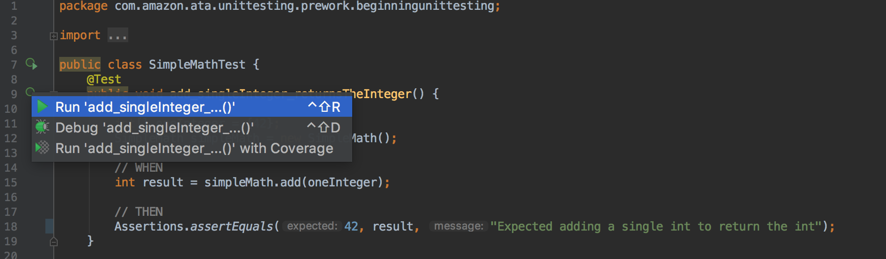
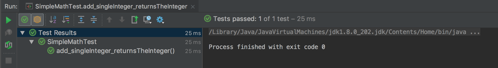
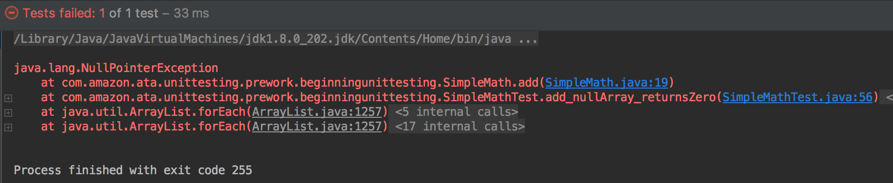
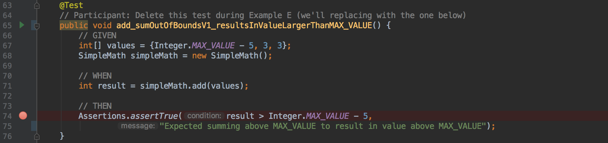
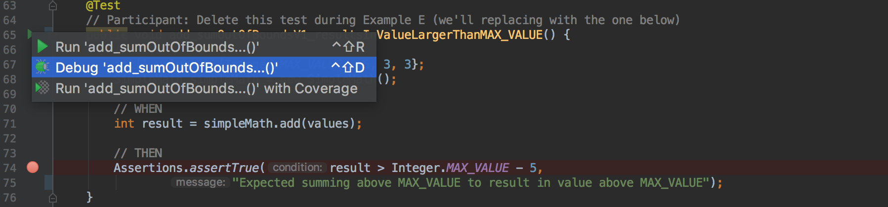
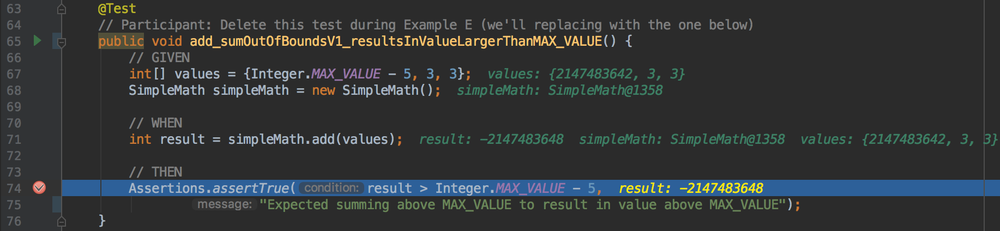
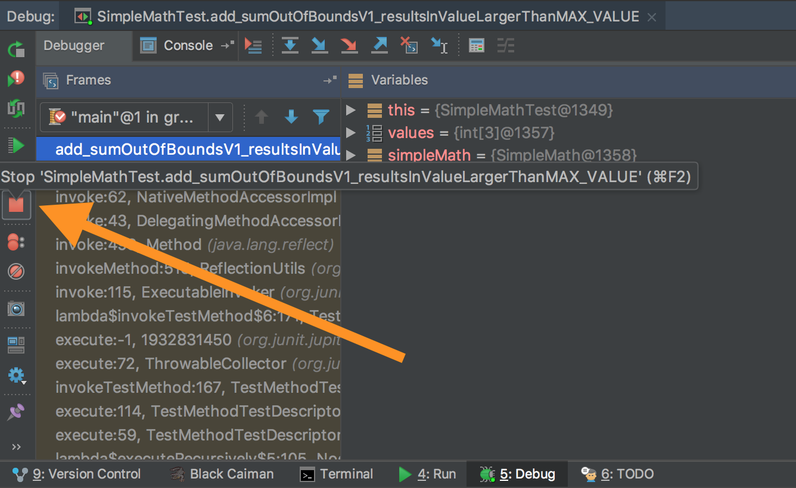
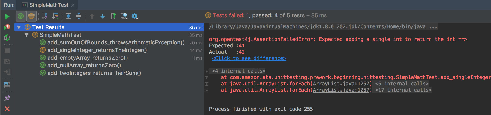

# Unit Testing Prework: Beginner's Guide to Unit Testing

## Unit Testing Fundamentals

Unit testing is a critical skill for modern software developers. This will cover what you need to know (and should practice!) to gain unit testing confidence.

### What is Unit Testing?

Unit testing is the code you write to test individual pieces of your production
code. Each time you write a new class in Java, you should also create a test
class. The test class will contain all of the unit tests that test your new
class. Unit testing is just the process of writing these unit tests and running
them. It's used to **ensure the quality of your working product**. Imagine
being a chef who never tastes your own food. Seems crazy, right? Unit testing
is what you do as a developer to ensure your code is working as desired, but in
a more automated fashion.

Your tests are also used by **other developers to learn how to use your code**.
They can read and run your tests to learn how it works. A full suite of unit
tests is often more useful than documentation or large quantities of comments.

Finally, your tests **ensure that changes don't unintentionally break existing
code** through what's called regression testing. A regression defect is a bug
that breaks existing working code. Regression testing is running existing,
working unit tests when changing code. It is a good practice to run all unit
tests when changing code, as it's possible that you've changed how two classes
interact. In fact, it's such a good practice that Amazon's build tools default
to running unit tests every time you re-compile!

### 3 Parts of a unit test: Given, When, Then

Unit tests follow a common pattern - GIVEN, WHEN, THEN. First, set up any
required data for the test case you're writing, often the inputs to the method
you're testing (GIVEN). Next, call the method that you're testing (WHEN).
Lastly, verify that the correct things happened (THEN). You'll see what we
mean in just a little bit, but first, let's consider a class that we want to
test....

## Examples using JUnit to test a Java class

Open up your ATA Classroom Snippets project in IntelliJ and under the src
directory, open the
`com.amazon.ata.unittesting.AtaAddition` class.
Let's consider this single-function class which will take an `int` array and
return the sum of all its members:

```java
package com.amazon.ata.unittesting.prework.beginningunittesting;

/**
 * A utility providing math operations (for now, just adding integers).
 */
public class AtaAddition {

    /**
     * Compute the sum of the integers in the array argument, throwing an
     * <see>ArithmeticException</see> if the sum exceeds overflows or
     * underflows MAX_INTEGER/MIN_INTEGER.
     * @param integers The array of ints for which to compute the sum
     * @return The sum of the integers in <code>integers</code>.
     */
    public int add(int[] integers) {
        int sum = 0;
        for (int x : integers) {
            sum += x;
        }
        return sum;
    }
}
```

(Note: There are intentionally a few more comments in the snippet code that
we'll use down below. For now, the above is the relevant code. Also note that
the javadoc description of the method's behavior isn't quite accurate yet with
respect to the `ArithmeticException` stuff -- don't worry, we'll get to that!)

There are several discussions to be had even around this tiny class. What if
the array is null? What if it's an empty array? What if the summed value is
greater than [`Integer.MAX_VALUE`](https://docs.oracle.com/javase/7/docs/api/java/lang/Integer.html#MAX_VALUE)
(the maximum allowed value for an `int`)? Or less than the corresponding
minimum allowed value, `MIN_VALUE`?

### Example A: A couple of basic test cases

Now, let's look at the unit tests we've provided: Look in the `tst/` dir under
the project, and navigate to the same package as above. You should find the
`AtaAdditionTest` unit test class waiting for you there! Most developers put
unit tests in that `tst/` top level directory and to declare test classes in
the same Java package as the classes that they test. Follow this convention!

We're using [JUnit5](https://junit.org/junit5/docs/current/user-guide/) for our
unit tests. There are other unit testing frameworks out there, but JUnit is
used heavily at Amazon and throughout the industry. You'll also find it's
pretty simple to get started, so let's get to it!

It's always good to start with some simple cases, often the “happy” cases where
things go exactly as planned and the calling code provides typical inputs.
Let's look at the first two in `AtaAdditionTest`:

```java
    @Test
    public void add_singleInteger_returnsTheInteger() {
        // GIVEN
        int[] oneInteger = {42};
        AtaAddition ataAddition = new AtaAddition();

        // WHEN
        int result = ataAddition.add(oneInteger);

        // THEN
        Assertions.assertEquals(42, result,
                                "Expected adding a single int to return the int");
    }

    @Test
    public void add_twoIntegers_returnsTheirSum() {
        // GIVEN
        int[] tuple = {6, 9};
        AtaAddition ataAddition = new AtaAddition();

        // WHEN
        int result = ataAddition.add(tuple);

        // THEN
        Assertions.assertEquals(15, result,
                                "Expected adding two ints to return their sum");
    }
```

Some more unit test anatomy to notice:

* The name of the unit test class is `<ClassUnderTest>Test` (here
`AtaAdditionTest` is testing `AtaAddition`)
* JUnit tests are `public` methods that return `void`
* JUnit tests are annotated with `@Test` to indicate to JUnit that they're unit
tests to be run. If you don't annotate the method with `@Test`, then it'll get
skipped. Note that if you wanted to create a helper method to be used by your
tests, you can just add that method to your test class without the `@Test`
annotation, and make it a `private` method.
* Here we're using the method naming convention of
`methodUnderTest_descriptiveTestCondition_expectedBehavior` (we're testing the
`add()` method and the first example above is the case of one `int`, where we
expect the result to be that same integer). There are other conventions out
there; when you join an Amazon team, follow their conventions. In ATA, we'll
use this one.
* In the `assertEquals()` method, we follow the best practice of providing a
message (the `String` parameter) indicating what the test is expecting to see
in the assert statement. This message is printed out if that assertion fails,
so it's a good idea to make it informative.
* Note that at the top of the test class, we have the following imports. The
first provides the class with the `assertXXX()` methods we use in the THEN
sections to verify the results we expect from the WHEN section. The second
gives us the `@Test` annotation to mark our tests:

```java
import org.junit.jupiter.api.Assertions;
import org.junit.jupiter.api.Test;
```


To run an individual unit test, click on the arrow in the margin next to the
method declaration and select “Run 'add_singleInteger_returnsTheInteger()'”:



In the console at the bottom of the IntelliJ window, you should see that the
test passed:



Now, do the same with the `add_twoIntegers_returnsTheirSum()` test.

These both should pass right away!

### Example B: Empty array test case

It's important to test the breadth of cases that your code might need to
contend with, including cases where someone might have made a mistake or use
your class in unintended ways. Let's consider the case that the array is empty
(which might or might not be a mistake, depending on the calling code), which
we decide is a valid case and should succeed without error and return zero.

```java
    @Test
    public void add_emptyArray_returnsZero() {
        // GIVEN
        int[] emptyArray = {};
        AtaAddition ataAddition = new AtaAddition();

        // WHEN
        int result = ataAddition.add(emptyArray);

        // THEN
        Assertions.assertEquals(0, result,
            "Expected empty array to sum to zero");
    }
```

Run this test. It should pass too.

### Example C: Null array Test case

What happens if the array is `null`? Some code might check for `null` values
and suppress calling our method or apply a default value, but we can't assume
anything about the code calling our class. Can our class handle a `null` array?

```java
    @Test
    public void add_nullArray_returnsZero() {
        // GIVEN
        int[] nullArray = null;
        AtaAddition ataAddition = new AtaAddition();

        // WHEN
        int result = ataAddition.add(nullArray);

        // THEN
        Assertions.assertEquals(0, result,
            "Expected null array to sum to zero");
    }
```

What behavior do we want for a `null` array? This is not an obvious decision. A
`null` array could be considered a previous error where an array, even if
empty, wasn't created correctly. This test expects the `add()` method to return
0, meaning a `null` array is treated the same as an empty array. This is one
way we can clearly state the intended behavior of our code (remember above:
“Your tests are also used by other developers to learn how to use your code”).

Run the `add_nullArray_returnsZero()` test and verify that you get something like the results
below:



Note that you can click on the
“AtaAddition.java:XX” link to jump to the place in the code where the exception
arises from., putting the cursor on that particular line. Go ahead and do so.
It should be pointing to the line:

```java
        for (int x : integers) {
```

where the for loop is calling a method on an Object, `integers`, that is
`null`, resulting in a `NullPointerException`. Here's an example of what's
called “Test-Driven Development” in action: we specified the desired behavior
of our class via automated tests and they revealed a flaw in our
implementation. Let's fix it! Update your `add()` method by adding the `if`
statement at the top of the method below:

```java
public class AtaAddition {
    public int add(int[] integers) {
        if (null == integers) {
            return 0;
        }

        // Comment the next block out for Example E
        // (tip: highlight through `return sum;` and hit Ctrl-Shift-/ )
        int sum = 0;
        for (int x : integers) {
            sum += x;
        }
        return sum;
    }
}
```

Now, rerun the test and verify that it passes!

Alternately, we could decide to throw an exception instead of returning a 0 in
the `null` case (which some engineers might prefer because it simplifies the
`add()` method a little. It really depends on how you want other code to use
your class, which you can unambiguously specify via your unit tests! But let's
stick with this behavior and move on.

### EXAMPLE E: Out of Bounds Test Case
#### Part 1: What's going on?

What if your class has a bounds issue? An array could contain very large
numbers which, when summed, will be larger than the maximum value that can be
stored in an `int` (an `int` is ultimately a specific number of bits that can
represent numbers only so large -- up to
[`Integer.MAX_VALUE`](https://docs.oracle.com/javase/7/docs/api/java/lang/Integer.html#MAX_VALUE)
-- and, perhaps unexpectedly, when you exceed that value, `int` s can “wrap
around” to very negative values (Optional: for more information see [Java
Integer Max Value](http://javadevnotes.com/java-integer-max-value)). This is
the naively written test that we'd expect to pass if there weren't a boundary
limitation:

```java
    @Test
    /**
     * This test assumes that adding enough values will result in a sum
     * greater than {@code Integer.MAX_VALUE}.
     
     * When an assumption is found to be incorrect, we must update our test
     * logic and names.
     */
    public void add_sumOutOfBounds_resultsInValueLargerThanMAX_VALUE() {
        // GIVEN
        int[] values = {Integer.MAX_VALUE - 5, 3, 3};
        AtaAddition ataAddition = new AtaAddition();

        // WHEN
        int result = ataAddition.add(values);

        // THEN
        Assertions.assertTrue(result > Integer.MAX_VALUE - 5,
                "Expected summing above MAX_VALUE to result in value above MAX_VALUE");
    }
```

Unfortunately, the test fails. To investigate further, set a breakpoint on the
assertion line by clicking in the margin next to that line, and a red circle
should appear. This means that when you run the test in debug mode, IntelliJ
will stop on that line and let you inspect.

)

Now run the test in debug mode by clicking the arrow next to the test
declaration and click “Debug 'add_sumOutOfBounds_resultsInValueLargerThanMAX_VALUE()':



IntelliJ's debugger helpfully displays the current value of all of the local
variables inline. Notice that result is negative (very negative in fact!).
Oops, it wrapped around!:



At this point, we can decide what to do, but we can't leave it as is. We tried
to specify our class behavior in this scenario a la Test-Driven Development,
but now we realize that we either have to change the return value (to something
'bigger' than an `int` -- but even then, we'll need to figure out our boundary
case behavior), or perhaps we should detect this case and throw an exception
rather than return a confusing result.

Before re-running any tests, to stop the debugger, hit the red square icon on
the far left on the lower pane as below (or in the upper right of the IntelliJ
window if you prefer):



#### Part 2: Let's revise the behavior of our method under test

Let's say we want to throw an `ArithmeticException` in the case of overflowing
or underflowing the result sum. We would **rename** the test to match the
expected behavior, then change the THEN section to verify the new result.

We haven’t learned how to handle exceptions yet, so we’ll provide the code.
In the example below, we’ve used `Assertion.assertThrows()`, which verifies that
some block of code throws a specified exception. Unfortunately, it also forces
us to combine our WHEN and THEN sections. You aren’t expected to understand the
syntax at this point, but you should be able to identify the expected
exception, the code block that gets tried, and the error message.

Change the `add_sumOutOfBounds_resultsInValueLargerThanMAX_VALUE()` method to
look like this (yes, including the method name itself, because we're changing
the method under test's behavior!):

```java
    @Test
    public void add_sumOutOfBounds_throwsArithmeticException() {
        // GIVEN
        int[] values = {Integer.MAX_VALUE - 5, 3, 3};
        AtaAddition ataAddition = new AtaAddition();

        // WHEN + THEN
        // the following syntax is a little fancy, just know that it's
        // asserting that when the inner code block calls the add()
        // method that we should see an `ArithmeticException`
        Assertions.assertThrows(ArithmeticException.class, () -> {
            ataAddition.add(values);
        }, "Summing above MAX_VALUE should result in ArithmeticException thrown");
    }
```

This is *really* getting to Test-Driven Development, where you write the tests
when you know your code can't pass them yet!

Take a close look to the call to `assertThrows()`: It looks kind of funky with the
first argument being `ArithmeticException.class`, and the second something like
`() -> { ... some code ... }`. The first argument tells JUnit which exception should
be thrown by the code that gets run as the second argument. That second argument is
a lambda function, something we'll learn more about later...but basically we're
telling JUnit to run the `ataAddition.add(values)` method call, and to make sure that
it throws an `ArithmeticException`.

#### Part 3: Fix the code and see a green test run!

This lesson isn't about the means of fixing this, so we're giving it to you in
the AtaAddition code already. Replace the implementation of `add()` with the
code in its Javadoc.

Your AtaAddition class should look like this now:

```java
    public int add(int[] integers) {
        if (null == integers) {
            return 0;
        }

        Long longSum = 0L;
        for (int x : integers) {
            longSum = longSum + x;

            // throw ArithmeticException on overflow/underflow of running sum
            if (longSum > Integer.MAX_VALUE) {
                throw new ArithmeticException("Sum overflowed Integer");
            } else if (longSum < Integer.MIN_VALUE) {
                throw new ArithmeticException("Sum underflowed Integer");
            }
        }

        return longSum.intValue();
    }
```


Now, the test should pass. Verify. You could imagine it might be appropriate to
create an “underflow” test as well, with integers that add up to a number less
than `Integer.MIN_VALUE`. This is a great idea to be comprehensive. We imagine
you'll know how to create that test (Optional: go for it!), so let's move on
for right now—we're almost done!

## Running all tests in a test class at once

Finally, to run ALL of the unit tests at once (best practice!), click on the
arrow next to the test class declaration (`public class AtaAdditionTest`...,
above the first test), and select “Run 'AtaAdditionTest'). IntelliJ shows the
test results of each test. Here, they should all pass.

Go back to one of the tests, and change the `42` in the first test's
`assertEquals()` call to `41`, then re-run all of the tests. You should see
something like the following:



Notes:

* There's a '!' next to the test that failed in the left pane
* The right pane shows the details for the failed test (including our assert message!). If there were multiple failures, you'd see each of their results in the right pane.

Now undo that `42` → `41` change, rerun all the tests and verify that they pass!

Run `./gradlew -q clean :test` to verify that the tests pass from the
terminal, too.

Congratulations, you're a unit tester!

Commit your changes and push them to your forked repo. 

Find the commit URL and answer the Canvas quiz.
